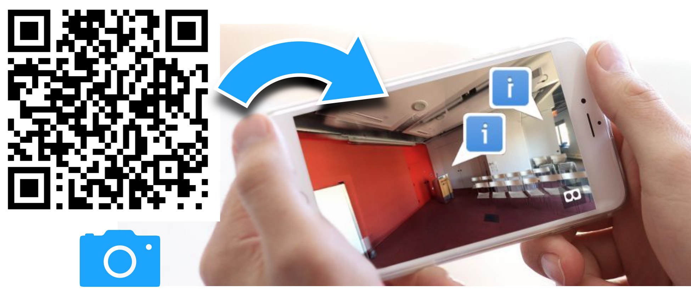

# 'DeviceOrientation' Extension

Use Forge Viewer like a panorama viewer - view the inside of a Revit building with your iPhone or iPad.

I recently had a customer asking for a quick way to showcase the inside of a building, like a panorama, but with Forge Viewer and a QR-code.  The idea was simple...

1. with my iPhone camera
2. scan the QR-Code (try the one above)

> This launches Forge Viewer and loads the Revit room and starts the 'first person' tool

3. Now, aim my iPhone up, down and around, to look around the room.

> Bonus points - add 3D markers everywhere using the [MarkupExt.js](https://github.com/wallabyway/markupExt).

**That's it.  Sounds simple, right?  Well... sort of.**

There's some quaternion math that ties the onDeviceOrientation events (in Euler degrees) from the iPhone compass/accelerometer, into the Forge Viewer's position/target camera object.

Anyone who's tried this, knows there's a bunch of ugly edge cases due to the portait/landscape modes and iPhone/Android differences.

Now, I know what you are thinking, "why don't you just use the [webVR extension](https://forge.autodesk.com/blog/more-forge-viewer-webvr-part-1-support-extra-threejs-mesh-webvr)?"

True, but I need full-screen panorama, not the split-screen that webVR offers.
*Besides, the webvr-polyfill, has been 'somewhat' unreliable trying to support so many devices.* 

Thankfully, the clever folks at Three.js have already figured out a robust solution already - [deviceOrientation.js](https://github.com/mrdoob/three.js/blob/dev/examples/js/controls/DeviceOrientationControls.js).  

I simply adapted this to the camera/target model, and we are done.  

To minimize the code further, I re-use the 'gamepad' interface inside the 'first person' tool. I supply a custom 'gamepad' component with the  'deviceOrientation' event overrides to control where the camera is looking.  Here's a ...

### [DEMO](https://wallabyway.github.io/deviceOrientationExt/)

## How to use:

Steps:

1. Add `` to your `index.html`
2. Click on the 'first person' tool

3. That's it !

You can find an example of how to use the extension on GitHub here: [https://github.com/wallabyway/deviceOrientationExt](https://github.com/wallabyway/deviceOrientationExt)

Feel free to add any issues you find to my Github [issues repo](https://github.com/wallabyway/deviceOrientationExt/issues).

Follow me on [Twitter @micbeale](http://twitter.com/micbeale)

